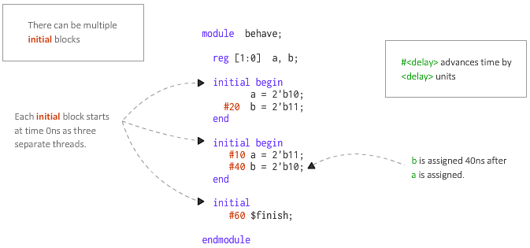

# Table of Contents

- [Table of Contents](#table-of-contents)
- [What is Verilog?](#what-is-verilog)
- [FPGA (Field Programmable Gate Array)](#fpga-field-programmable-gate-array)
- [Synthesizable vs. Non-Synthesizable code](#synthesizable-vs-non-synthesizable-code)
- [Best Practices](#best-practices)
  - [Verilog Naming Convention](#verilog-naming-convention)
- [Compiling and Simulating a file in Modelsim](#compiling-and-simulating-a-file-in-modelsim)
- [Lexical Tokens](#lexical-tokens)
  - [White Space](#white-space)
  - [Comments](#comments)
  - [Numbers](#numbers)
    - [Integer Number](#integer-number)
  - [Identifiers](#identifiers)
  - [Operators](#operators)
    - [Arithmetic Operators](#arithmetic-operators)
    - [Bitwise Operators](#bitwise-operators)
    - [Reduction Operators](#reduction-operators)
    - [Relational Operators](#relational-operators)
    - [Logical Operators](#logical-operators)
    - [Shift Operators](#shift-operators)
    - [Assignment Operators](#assignment-operators)
    - [Other Operators](#other-operators)
  - [Operands](#operands)
    - [`reg` (register)](#reg-register)
    - [`wire` (net/network)](#wire-netnetwork)
- [Vectors & Scalars](#vectors--scalars)
  - [Overflow of Values](#overflow-of-values)
  - [High Impedance (`z`) and Undefined (`x`) Values](#high-impedance-z-and-undefined-x-values)
- [Verilog Concatenation](#verilog-concatenation)
- [Verilog Replication](#verilog-replication)
- [Block Statements](#block-statements)
  - [Sequential Block-Statements](#sequential-block-statements)
  - [Parallel Block Statements](#parallel-block-statements)
  - [Naming of Blocks](#naming-of-blocks)
- [Procedural Blocks](#procedural-blocks)
  - [`initial` Statement](#initial-statement)
    - [Syntax for using `initial` statement](#syntax-for-using-initial-statement)
      - [Multiple `initial` statements in a program](#multiple-initial-statements-in-a-program)
  - [`always` Statement](#always-statement)
    - [Syntax for using `always` statement](#syntax-for-using-always-statement)
    - [Sensitivity List](#sensitivity-list)
- [Assignments in Verilog](#assignments-in-verilog)
  - [Procedural Assignments](#procedural-assignments)
    - [Blocking Assignment (`=`)](#blocking-assignment-)
    - [Non-Blocking Assignment (`<=`)](#non-blocking-assignment-)
  - [Continuous Assignment](#continuous-assignment)
  - [Driving values in verilog](#driving-values-in-verilog)
- [Verilog Module](#verilog-module)
  - [Top-level Modules](#top-level-modules)
  - [`design` Top-Level](#design-top-level)
  - [`testbench` Top-Level](#testbench-top-level)
- [Verilog Ports](#verilog-ports)
  - [Port Declaration](#port-declaration)
  - [`wire` and `reg`](#wire-and-reg)
- [Verilog Compiler Directives](#verilog-compiler-directives)
  - [1. `timescale](#1-timescale)
    - [Checking the Default Timescale (`$printtimescale`)](#checking-the-default-timescale-printtimescale)
  - [2. `include](#2-include)
- [Verilog System Tasks](#verilog-system-tasks)
- [Verilog Timing Control](#verilog-timing-control)
  - [Delay control](#delay-control)
  - [Rise and Fall](#rise-and-fall)
- [Types of Modeling](#types-of-modeling)
  - [Dataflow Modelling](#dataflow-modelling)
  - [Gate-Level Modelling](#gate-level-modelling)
  - [Behavorial Modelling](#behavorial-modelling)
- [TODO](#todo)

# What is Verilog?

Verilog is a Hardware Description Language (HDL). 

- It is a language used for describing a digital system such as a network switch, a microprocessor, a memory, or a flip-flop. 

  We can describe any digital hardware by using HDL at any level. 

- Designs described in HDL are independent of technology, very easy for designing and debugging, and are normally more useful than schematics, particularly for large circuits.

- Another distinctive characteristic of an HDL is that it models massive amounts of parallel processes. At the lowest level of digital design, every primitive gate (AND, OR, DFF) is an independent concurrent process. 

  Modules are containers representing processes modeled at different levels of abstraction. Groups of primitives and modules pass values to each other via networks of signals. 

# FPGA (Field Programmable Gate Array)

TODO

# Synthesizable vs. Non-Synthesizable code

When you write you Verilog or VHDL code, you are writing code that will be translated into gates, registers, RAMs, etc. 

The program that performs this task is known as a **Synthesis Tool**. It is the job of the **Synthesis Tool** to take your Verilog or VHDL code and turn it into something that the FPGA can understand. 

However, there are some parts of Verilog and VHDL that the FPGA simply cannot implement. When you write code like this, it is called non-synthesizable code.

So why would you have a language that contains code that is non-synthesizable? 

The reason is that it makes your testbenches more powerful. When you write a testbench for simulation, often using non-synthesizable code constructs makes your testbench better and allows you to accomplish things easier.

# Best Practices

Only one `module` should be defined per verilog file. 

## Verilog Naming Convention

| Construct                                                             | Style                          |
| --------------------------------------------------------------------- | ------------------------------ |
| Declarations (module, class, package, interface)                      | `lower_snake_case`             |
| Instance names                                                        | `lower_snake_case`             |
| Signals (nets and ports)                                              | `lower_snake_case`             |
| Variables, functions, tasks                                           | `lower_snake_case`             |
| Named code blocks                                                     | `lower_snake_case`             |
| **\`define** macros                                                   | `ALL_CAPS`                     |
| Tunable parameters for parameterized modules, classes, and interfaces | `UpperCamelCase`               |
| Constants                                                             | `ALL_CAPS` or `UpperCamelCase` |
| Enumeration types                                                     | `lower_snake_case_e`           |
| Other typedef types                                                   | `lower_snake_case_t`           |
| Enumerated value names                                                | `UpperCamelCase`               |

# Compiling and Simulating a file in Modelsim

1. Open modelsim 
2. `Create Project` (keep project name in PascalCase)
3. `Create New File` (Change file type from default `VHDL` to `Verilog`, and keep the library as default - `work`)
4. File is created
5. Right click on the file name and click on `Edit`
6. After writing the code, right click on the file again, and click on `Compile Selected`
7. `Status` symbol next to file name changes from a question mark to tick to indicate that compilation was successful. Successful message also shown in Transcript panel
8. Next, in order to convert the source code into a model, we have to simulate the compiled **module**.
9. Go to the `Library` panel, into the `work` library, right-click on the module and selecte `Simulate`.
10. The Layout of ModelSim changes from `No Design` to `Simulate`.
11. a. Select the `Instance` of the module from the `sim` tab, then drag the `Objects` i.e., the quantities you wish to see in the `Waves` panel
    b. Or right click on a particular quantity in Object panel and select `Add Waves` 
12. We can `Force` quantities to be a certain value in the `Waves` panel by right-clicking on them.
13. Press `F9` to run the simulation behaviour

# Lexical Tokens

A lexical token is a sequence of characters that can be treated as a unit in the grammar of the programming languages.

Lexical conventions in Verilog are similar to the C programming language. Verilog language source text files are a stream of lexical tokens.

A lexical token may consist of one or more characters, and every single character is in exactly one token.

The tokens can be keywords, comments, numbers, white space, or strings. 

All lines should be terminated by a semi-colon (`;`).

## White Space

White space can contain the characters for tabs, blanks, newlines, and form feeds. These characters are ignored except when they serve to separate other tokens. However, blanks and tabs are significant in strings.

## Comments

Like in C-language

## Numbers 

We can specify constant numbers in binary, decimal, hexadecimal, or octal format. 

Negative numbers are represented in 2's complement form. 

The question mark (`?`) character is the Verilog alternative for the z character when used in a number. 

The underscore character (`_`) is legal anywhere in a number, but it is ignored as the first character.

### Integer Number

Verilog HDL allows integer numbers to be specified as:

- Sized or unsized numbers (Unsized size is 32 bits).
- In a radix of decimal (`d`), hexadecimal (`h`), binary (`b`) or octal (`o`).
- Radix and hex digits (a,b,c,d) are case INSENSITIVE. Spaces are allowed between the radix, size, and value.


The syntax is given as:

```verilog
<size>'<radix><value>  

// Examples
1'b0
32'd10
10'h f1
```
## Identifiers

The identifier is the name used to define the object, such as a function, module, or register. 

- Identifiers must begin with an alphabetic character or the underscore character (`a-z`, `A-Z`, `_`).
- Identifiers may contain alphabetic characters, numeric characters, the underscore, and the dollar sign (`a-z`, `A-Z`, `0-9`, `_`, `$`).

- Identifiers can be up to 1024 characters long.

## Operators

### Arithmetic Operators

  For the FPGA, division and multiplication are very expensive, and sometimes we cannot synthesize division. If we use Z or X for values, the result is unknown. The operations treat the values as unsigned.

  | Character |	Operation performed |	Example |
  |-|-|-|
  | `+` |	Add |	b + c = 11 |
  | `-` |	Subtract |	b - c = 9, -b=-10 |
  | `/` |	Divide |	b / a = 2 |
  | `*` |	Multiply |	a * b = 50 |
  | `%` |	Modulus |	b % a = 0 |

### Bitwise Operators
    
  Each bit is operated, the result is the size of the largest operand, and the smaller operand is left extended with zeroes to the bigger operand's size.
    
  | Character |	Operation performed |	Example |
  |----|----|------|
  | `~` |	Invert each bit |	~a = 3'b010 |
  | `&` |	And each bit | b & c = 3'b010 |
  | `\|` | Or each bit	| a \| b = 3'b111 |
  | `^`	| Xor each bit	| a ^ b = 3'b011 |
  | `^~` or `~^` |	Xnor each bit |	a ^~ b = 3'b100 |

### Reduction Operators

  These operators reduce the vectors to only one bit. If there are the characters z and x, the result can be a known value.

  | Character |	Operation performed |	Example |
  |-|-|-|
  | `&` |	And all bits |	&a = 1'b0, &d = 1'b0 |
  | `~&` |	Nand all bits	| ~&a = 1'b1 |
  | `\|` |	Or all bits	| \|a = 1'b1, \|c = 1'bX |
  | `~\|` |	Nor all bits |	~\|a= 1'b0 |
  | `^` |	Xor all bits |	^a = 1'b1 |
  | `^~` or `~^` |	Xnor all bits |	~^a = 1'b0 |

### Relational Operators

  These operators compare operands and results in a 1-bit scalar Boolean value. The case equality and inequality operators can be used for unknown (`x`) or high impedance values (`z`), and if the two operands are unknown, the result is a 1.

  | Character |	Operation performed |	Example |
  |-|-|-|
  | `>` |	Greater than |	a > b = 1'b0 |
  | `<` |	Smaller than | a < b = 1'b1 |
  | `>=` |	Greater than or equal |	a >= d = 1'bX |
  | `<=` | Smaller than or equal |	a <= e = 1'bX |
  | `==` |	Equality	| a == b = 1'b0 |
  | `!=` |	Inequality |	a != b = 1'b1 |
  |`===` |	Case equality	| e === e = 1'b1 |
  | `!===` |	Case inequality	| a !== d = 1'b1 |

### Logical Operators

  These operators compare operands and results in a 1-bit scalar Boolean value.

  | Character |	Operation performed |	Example |
  |-|-|-|
  | `!` |	Not true |	!(a && b) = 1'b1 |
  | `&&` | Both expressions true	| a && b = 1'b0 |
  | `\|\|` | One ore both expressions true |	a \|\| b = 1'b1 |

### Shift Operators
  
  These operators shift operands to the right or left, the size is kept constant, shifted bits are lost, and the vector is filled with zeroes.

  | Character |	Operation performed |	Example |
  |-|-|-|
  | `>>` |	Shift right	| b >> 1 results 4?b010X |
  | `<<` |	Shift left	| a << 2 results 4?b1000 |

### Assignment Operators
There are three assignment operators, each of which performs different tasks, and are used with different data types:

   - `assign` : ([continuous assignment](#continuous-assignment))
   -   `<=`   : ([non-blocking assignment](#non-blocking-assignment))
   -    `=`   : ([blocking assignment](#blocking-assignment))

### Other Operators

  These are operators used for condition testing and to create vectors.

  | Character |	Operation performed |	Example |
  |-----------|---------------------|---------|
  |  `?:`	    |Conditions testing	  | test cond. `?` if true do this `:` if not do this|
  | `{}`	    | [Concatenation](#verilog-concatenation)	        | c = {a,b} = 8'101010x0|
  |`{{}}`     |	[Replication](#verilog-replication)       |	{3{`2'b10`}} = `6'b101010`|

## Operands

Operands are expressions or values on which an operator operates or works. All expressions have at least one operand.

### `reg` (register)

Identifiers declared as `reg` are manipulated within procedural blocks ([`always` and `initial`](#initial-and-always-statements)) only.

Registers represent data storage elements. 

Registers retain value until another value is placed onto them. 

In Verilog, the term register merely means a variable that can hold a value.

### `wire` (net/network)

In Verilog, a `wire` declaration represents a network (net) of connections with each connection either driving a value or responding to the resolved value being driven on the net. 

The output of each of these concurrent processes drives a net in what is called a [***continuous assignment***](#continuous-assignment) because the process continually updates the value it wants to drive on the net. 

# Vectors & Scalars

By default, a Verilog [`reg`](#wire-and-reg) or [`wire`](#wire-and-reg) is 1 bit wide. This is a scalar:

```verilog
wire  x;  // 1 bit wire
reg   y;  // also 1 bit
logic z;  // me too!
```

A scalar can only hold 0 or 1.

We need a vector to hold values other than 0 and 1.

A vector is declared like this: 

```verilog
type [upper:lower] name;

wire   [5:0] a;  // 6-bit wire
reg    [7:0] b;  // 8-bit reg
logic [11:0] c;  // 12-bit logic
```

- `wire` **a** handles 0-63 inclusive : 6 bits from $2^0$ to $2^5$ ($2^6$ is 64).
- `register` **b** handles 0-255 inclusive : 8 bits from $2^0$ to $2^7$ ($2^8$ is 256).
- `logic` **c** handles 0-4095 inclusive : 12 bits from $2^0$ to $2^{11}$ ($2^{12}$ is 4096).

You need to ensure your vector is large enough to handle the full range of values your design requires. 

Synthesis tools are good at discarding unused bits, so it’s better to err on the side of too large rather than too small.


## Overflow of Values

```verilog
module main;
  reg[1:0] b;
  
  initial begin
    b = 5'b11110;
    $display(b);
    $finish;
  end

endmodule
```

Although `b` is a 2-bit `reg`, if we try assigning a 5-bit value to it, no error will be thrown.

Its just that the extra bits will be discarded, and the 2 LSBs will be assigned to `b`.

Output:
```
10
```

## High Impedance (`z`) and Undefined (`x`) Values 

TODO

# Verilog Concatenation

Multi-bit Verilog `wires` and variables (`reg`) can be clubbed together to form a bigger multi-net `wire` or variable (`reg`) using concatenation operators `{` and `}` separated by commas. 

Concatenation is also allowed to have expressions and sized constants as operands in addition to `wires` and variables (`reg`).

Size of each operand must be known in order to calculate the complete size of concatenation.

Verilog Concatenation Example
```verilog
wire a, b;// 1-bit wire
wire[1:0] result1;// 2-bit wire to store a and b

// result1[1] follows a, and result1[0] follows b
assign res = {a, b};

wire[2:0] c;
wire[7:0] result2;

// result2[0]   follows c[2]
// result2[2:1] is always 0
// result2[4:3] follows c[1:0]
// result2[5]   follows a
// result2[6]   follows b
assign result2 ={b, a, c[1:0], 2'b00, c[2]};
```
Here is a working design example of concatenation of inputs to form different outputs. 

Concatenated expressions can be simply displayed or assigned to any `wire` or variable (`reg`), not necessarily outputs.

# Verilog Replication 

When the same expression has to be repeated for a number of times, a ***replication constant*** is used which needs to be a non-negative number and cannot be `X`, `Z` or any variable.

This constant number is also enclosed within braces along with the original concatenation operator and indicates the total number of times the expression will be repeated.

```verilog
wire a;
wire[6:0] result;

assign result = {7{a}};

{2'bz{2'b0}} // Illegal to have Z as replication constant
{2'bx{2'b0}} // Illegal to have X as replication constant
```

Replication expressions CANNOT:
1. Appear on the left hand side of any assignment 
2. Be connected to `output` or `inout` ports.

# Block Statements

There are ways to group a set of statements together that are syntactically equivalent to a single statement and are known as Block Statements.

There are two types of block statements:
- Sequential
- Parallel

## Sequential Block-Statements

In Sequential Block-Statements, a set of statements are wrapped using `begin` and `end` keywords and will be executed sequentially in the given order, one after the other. 


After all the statements within the block are executed, control may be passed elsewhere. 

Delay values are treated relative to the time of execution of the previous statement. 


 In this example, the first statement in the `begin`-`end` block will be executed at `10` time units, and the second statement at `30` time units because of the relative nature. 
 
 It is `20` time units after execution of the previous statement.

## Parallel Block Statements
 
A Parallel Block-Statement can execute statements concurrently and delay control can be used to provide time-ordering of the assignments. 

Statements are launched in parallel by wrapping them within the `fork` and `join` keywords.

Delay values are treated as absolute from the start of the Parallel Block. 


 In this example, the `fork`-`join` block will be launched after executing the statement at `10` time units.
 
 Statements within this block will be executed in parallel and the first statement that will be launched will be the one where data is assigned a value of `8'h00` since the delay for that is `10` time units after the launch of the fork-join. 
 
 After `10` MORE time units, the first statement will be launched and data will get the value `8'h11`.

## Naming of Blocks

Both [Sequential](#sequential-block-statements) and [Parallel](#parallel-block-statements) blocks can be named by adding `name_of_block` after the `begin` and `fork` keywords. 

```verilog
begin: name_seq  
    [statements]  
end  
fork: name_fork  
    [statements]  
join  
```

By doing this, the block can be referenced in a `disable` statement.

# Procedural Blocks

Two basic structured procedure statements or procedural blocks are `always` ([synthesizable](#synthesizable-vs-non-synthesizable-code)) and `initial` ([non-synthesizable](#synthesizable-vs-non-synthesizable-code)).

General common information about these blocks:

- All behavioral statements can appear only inside these blocks
- Each `always` or `initial` block has a separate activity flow (concurrency)
- There can be multiple `always` and `initial` blocks in a module
- All procedural blocks start from simulation time 0
- Cannot be nested
- `initial` and `always` statements describe independent processes (blocks of code), meaning that the statements in one process execute autonomously. 

## `initial` Statement

`initial` processes execute once

### Syntax for using `initial` statement

```verilog
initial  
    [single statement]  
  
initial begin  
    [multiple statements]  
  
end  
```

#### Multiple `initial` statements in a program

There are no limits to the number of initial blocks that can be defined inside a module. 



The code shown below has three initial blocks, all of which are STARTED AT THE SAME TIME and run in parallel.

However, depending on the statements and the delays within each initial block, the time taken to finish the block may vary.

## `always` Statement

`always` processes execute repeatedly forever. 

As such, an `always` process must contain timing statements that will occasionally block execution and allow time to advance (time in `initial` and `always` process only advances when they are blocked). 

Thus, activity in these process progresses in a burst during which time does not advance, and then the activity blocks, which allows time to move forward.

### Syntax for using `always` statement

```verilog
always @ (event)  
    [statement]  
  
always @ (event) begin  
    [multiple statements]  
end  
```

The symbol `@` after the reserved word `always`, indicates that the block will be triggered at the condition in parenthesis after symbol `@`.

In any combinational logic, output changes whenever input changes. 

When this theory is applied to `always` blocks, then the code inside always blocks needs to be executed whenever the input or output variables change.

### Sensitivity List

A sensitivity list is an expression that defines when the `always` block should be executed, and it is specified after the `@` operator within the parentheses ( ). 

This list may contain either one or a group of signals whose **value change** will execute the `always` block.

In the code shown below, all statements inside the `always` block executed whenever the value of signals `x` or `y` change.

```verilog
always @ (x or y) begin  
    [statements]  
end  
```

The `always` block repeats continuously throughout a simulation. 

The sensitivity list brings a certain sense of timing, i.e., whenever any signal in the sensitivity list changes, the `always` block is triggered.

If there are no timing control statements within an `always` block, the simulation will hang because of a zero-delay infinite loop.

# Assignments in Verilog

## Procedural Assignments

The concept of ***procedural assignment*** is that when we write a value into a variable, that value is saved until the next assignment to that variable. 

This is part of executing an ordered set of statements. The last assignment determines the current value of the variable.

An HDL like Verilog may add some notion of time in between assignments and other statements. 

```verilog
module test;
  reg a, b, c, d;
  
  initial begin 
    a = 1'b0;
    b = 1'b1;
    
    {c, d} = b+a; // Here we are assigning the 2 bit sum of addition of a and b to c and d, where 'd' is assigned the LSB and 'c' is assigned the MSB.
  end
endmodule
```

### Blocking Assignment (`=`)

Blocking assignment statements are assigned using `=` and are executed one after the other in a [procedural block](#procedural-blocks). 

However, this will not prevent execution of statements that run in a parallel block.

```verilog
module tb;
  reg [7:0] a, b, c, d, e;

  initial begin
    a = 8'hDA;
    $display ("[%0t] a=0x%0h b=0x%0h c=0x%0h", $time, a, b, c);
    b = 8'hF1;
    $display ("[%0t] a=0x%0h b=0x%0h c=0x%0h", $time, a, b, c);
    c = 8'h30;
    $display ("[%0t] a=0x%0h b=0x%0h c=0x%0h", $time, a, b, c);
  end

  initial begin
    d = 8'hAA;
    $display ("[%0t] d=0x%0h e=0x%0h", $time, d, e);
 	e = 8'h55;
    $display ("[%0t] d=0x%0h e=0x%0h", $time, d, e);
  end
endmodule
```

Note that there are two `initial` blocks which are executed in parallel when simulation starts. 

Statements are executed sequentially in each block and both blocks finish at time `0ns`. 

To be more specific, variable `a` gets assigned first, followed by the display statement which is then followed by all other statements. 

This is visible in the output where variable b and c are `8'hxx` in the first display statement. This is because variable `b` and `c` assignments have not been executed yet when the first `$display` is called.

**Simulation Log**

```
ncsim> run
[0] a=0xda b=0xx c=0xx
[0] a=0xda b=0xf1 c=0xx
[0] a=0xda b=0xf1 c=0x30
[0] d=0xaa e=0xx
[0] d=0xaa e=0x55
ncsim: *W,RNQUIE: Simulation is complete.
```

---

In the next example, we'll add a few delays into the same set of statements to see how it behaves.

```verilog
module tb;
  reg [7:0] a, b, c, d, e;

  initial begin
    a = 8'hDA;
    $display ("[%0t] a=0x%0h b=0x%0h c=0x%0h", $time, a, b, c);
    #10 b = 8'hF1;
    $display ("[%0t] a=0x%0h b=0x%0h c=0x%0h", $time, a, b, c);
    c = 8'h30;
    $display ("[%0t] a=0x%0h b=0x%0h c=0x%0h", $time, a, b, c);
  end

  initial begin
    #5 d = 8'hAA;
    $display ("[%0t] d=0x%0h e=0x%0h", $time, d, e);
 	#5 e = 8'h55;
    $display ("[%0t] d=0x%0h e=0x%0h", $time, d, e);
  end
endmodule
```

**Simulation Log**

```
ncsim> run
[0] a=0xda b=0xx c=0xx
[5] d=0xaa e=0xx
[10] a=0xda b=0xf1 c=0xx
[10] a=0xda b=0xf1 c=0x30
[10] d=0xaa e=0x55
ncsim: *W,RNQUIE: Simulation is complete.
```

---

### Non-Blocking Assignment (`<=`)

Non-blocking assignment allows assignments to be scheduled without blocking the execution of following statements and is specified by a `<=` symbol. 

It's interesting to note that the same symbol is used as a relational operator in expressions, and as an assignment operator in the context of a non-blocking assignment.

```verilog
module tb;
  reg [7:0] a, b, c, d, e;

  initial begin
    a <= 8'hDA;
    $display ("[%0t] a=0x%0h b=0x%0h c=0x%0h", $time, a, b, c);
    b <= 8'hF1;
    $display ("[%0t] a=0x%0h b=0x%0h c=0x%0h", $time, a, b, c);
    c <= 8'h30;
    $display ("[%0t] a=0x%0h b=0x%0h c=0x%0h", $time, a, b, c);
  end

  initial begin
    d <= 8'hAA;
    $display ("[%0t] d=0x%0h e=0x%0h", $time, d, e);
 	e <= 8'h55;
    $display ("[%0t] d=0x%0h e=0x%0h", $time, d, e);
  end
endmodule
```

**Simulation Log**

```
ncsim> run
[0] a=0xx b=0xx c=0xx
[0] a=0xx b=0xx c=0xx
[0] a=0xx b=0xx c=0xx
[0] d=0xx e=0xx
[0] d=0xx e=0xx
ncsim: *W,RNQUIE: Simulation is complete.
```

The reason for this output is that the RHS of every non-blocking statement of a particular time-step is captured, and moves onto the next statement. 

> _NOTE:_ The captured RHS value is assigned to the LHS variable only **at the end of the time-step.**

So, if we break down the execution flow of the above example we'll get something like what's shown below.
```
|__ Spawn Block1: initial
|      |___ Time #0ns : a <= 8'DA, is non-blocking so note value of RHS (8'hDA) and execute next step
|      |___ Time #0ns : $display() is blocking, so execute this statement: But a hasn't received new values so a=8'hx
|      |___ Time #0ns : b <= 8'F1, is non-blocking so note value of RHS (8'hF1) and execute next step
|      |___ Time #0ns : $display() is blocking, so execute this statement. But b hasn't received new values so b=8'hx
|      |___ Time #0ns : c <= 8'30, is non-blocking so note value of RHS (8'h30) and execute next step
|      |___ Time #0ns : $display() is blocking, so execute this statement. But c hasn't received new values so c=8'hx
|      |___ End of time-step and initial block, assign captured values into variables a, b, c
|
|__ Spawn Block2: initial
|      |___ Time #0ns : d <= 8'AA, is non-blocking so note value of RHS (8'hAA) and execute next step
|      |___ Time #0ns : $display() is blocking, so execute this statement: But d hasn't received new values so d=8'hx
|      |___ Time #0ns : e <= 8'55, is non-blocking so note value of RHS (8'h55) and execute next step
|      |___ Time #0ns : $display() is blocking, so execute this statement. But e hasn't received new values so e=8'hx
|      |___ End of time-step and initial block, assign captured values into variables d and e
|
|__ End of simulation at #0ns
```

---

Next, let's add delays so that the end of the current time-step is reached before displaying the values.

```verilog
module tb;
  reg [7:0] a, b, c, d, e;

  initial begin
    a <= 8'hDA;
    $display ("[%0t] a=0x%0h b=0x%0h c=0x%0h", $time, a, b, c);
    #10 b <= 8'hF1;
    $display ("[%0t] a=0x%0h b=0x%0h c=0x%0h", $time, a, b, c);
    c <= 8'h30;
    $display ("[%0t] a=0x%0h b=0x%0h c=0x%0h", $time, a, b, c);
  end

  initial begin
    #5 d <= 8'hAA;
    $display ("[%0t] d=0x%0h e=0x%0h", $time, d, e);
 	#5 e <= 8'h55;
    $display ("[%0t] d=0x%0h e=0x%0h", $time, d, e);
  end
endmodule
```

We can see that the output is different than what we got before.

**Simulation Log**
```
ncsim> run
[0] a=0xx b=0xx c=0xx
[5] d=0xx e=0xx
[10] a=0xda b=0xx c=0xx
[10] a=0xda b=0xx c=0xx
[10] d=0xaa e=0xx
ncsim: *W,RNQUIE: Simulation is complete.
```

If we break down the execution flow we'll get something like what's shown below.

```
|__ Spawn Block1 at #0ns: initial
|      |___ Time #0ns : a <= 8'DA, is non-blocking so note value of RHS (8'hDA) and execute next step
|      |___ Time #0ns : $display() is blocking, so execute this statement: But a hasn't received new values so a=8'hx
|      |___ End of time-step : Assign captured value to variable a, and a is now 8'hDA
|      |___ Wait until time advances by 10 time-units to #10ns
|	
|      |___ Time #10ns : b <= 8'F1, is non-blocking so note value of RHS (8'hF1) and execute next step
|      |___ Time #10ns : $display() is blocking, so execute this statement. But b hasn't received new values so b=8'hx
|	   |___ Time #10ns : c <= 8'30, is non-blocking so note value of RHS (8'h30) and execute next step
|      |___ Time #10ns : $display() is blocking, so execute this statement. But c hasn't received new values so c=8'hx
|      |___ End of time-step and initial block, assign captured values into variables b, c
|	
|__ Spawn Block2 at #0ns: initial
|      |___ Wait until time advances by 5 time-units to #5ns
|	
|      |___ Time #5ns : d <= 8'AA, is non-blocking so note value of RHS (8'hAA) and execute next step
|      |___ Time #5ns : $display() is blocking, so execute this statement: But d hasn't received new values so d=8'hx
|      |___ End of time-step : Assign captured value to variable d, and d is now 8'hAA
|      |___ Wait until time advances by 5 time-units to #5ns
|	
|      |___ Time #10ns : e <= 8'55, is non-blocking so note value of RHS (8'h55) and execute next step
|      |___ Time #10ns : $display() is blocking, so execute this statement. But e hasn't received new values so e=8'hx
|      |___ End of time-step and initial block, assign captured values to variable e, and e is now 8'h55
|
|__ End of simulation at #10ns
```

## Continuous Assignment

There are various ways to declare a *continuous assignment*, all of which represent permanent behaviors:

```verilog
wire A, B, C; 
assign A = B | C; // continuous assignment construct. 
or(A,B,C); // gate-level instance terminal connection 
mymodule m1(A,B,C); // module instance port connection 
```

- The target of a *continuous assignment* must be a [`wire`](#wire). 

- A *continuous assignment* is not a procedural statement, obviously. So, it must be used at the module level; it cannot be placed in an [`initial` or `always`](#initial-and-always-statements) [procedural block](#procedural-blocks).

- A delay can be added to a *continuous assignment* as follows:

  ```verilog
  assign #10 a = b & c;
  ```

  In this case, the value of `a` changes 10 units of time after the expression `b & c` changes. 

## Driving values in verilog

A driver is a concurrent process that determines the value of a signal.

Taking the above examples:
```verilog
wire A, B, C; 
assign A = B | C; // continuous assignment construct. 
or(A,B,C); // gate-level instance terminal connection 
mymodule m1(A,B,C); // module instance port connection 
```

Although these are all different forms of ***continuous assignment*** constructs, none of them **directly assign** a value to a variable like a ***procedural assignment*** would. 

All of the values being concurrently driven onto the net are passed into a *built-in resolution function*. 

The result of that *resolution function* is based on the strengths of each driver representing the hardware technology in use. For example, an interrupt request signal might use the wired-or (wor) kind of net to indicate that at least one device is driving a `1`, otherwise it will resolve to a `0`. 

Some signals will have weaker pull-up/down resistors that will be overridden by the values of a stronger driver. 

Most technologies do not allow driving different values on the same net and the net will resolve to an unknown `x` when that happens. 

In most applications, only one driver is actively assigning a `0` or `1` and the other drivers are effectively turned off by driving a high-impedance or `z` state. The consequence of this is that a bi-directional port must be modeled using a net in order to have multiple drivers on either side of the port.

# Verilog Module

A module is a block of Verilog code that implements certain functionality. 

Modules can be embedded/instantiated within other modules, and a higher level module can communicate with its lower-level modules using their `input` and `output` [ports](#verilog-ports).

A module should be enclosed within a `module` and `endmodule` keywords. 

The name of the module should be given right after the `module` keyword, and an optional list of ports may be declared as well.

```verilog
module <name> ([port_list]);  
        // Contents of the module  

endmodule  

// A module can have an empty portlist  
  
module name;  
        // Contents of the module  
  
endmodule  

```

## Top-level Modules

A top-level module is one that contains  all other modules. Although module definitions can't contain other module definitions, but modules can be instantiated within other module definitions.

A top-level module is not INSTANTIATED within any other module.

For example, `design` modules are usually instantiated within top-level `testbench` modules so that simulation can be run by providing input stimulus.

But, the `testbench` is not instantiated within any other module because it is a block that encapsulates everything else.

## `design` Top-Level

The Design top-level module contains all other sub-modules required to make the design complete.

## `testbench` Top-Level

The `testbench` module contains a stimulus to check the functionality of the `design` and primarily used for functional verification by using simulation tools.

Hence the `design` is instantiated and called `<name>` inside the `testbench` module. 

The `testbench` is the top-level module from a simulator perspective.

# Verilog Ports

Port is an essential component of the Verilog module. 

Ports are used by a module to communicate with the external world through `input` and `output`.

## Port Declaration

Every port in the port list must be declared as `input`, `output` or `inout`, based on the port signal's direction.

Every port in the port list must be declared as `input`, `output` or `inout`. 

## `wire` and `reg`

In Verilog, all port declarations are implicitly declared as `wire`. If a port is intended to be a `wire`, it is sufficient to declare it as `output`, `input`, or `inout`.

`input` and `inout` ports are generally declared as wires. 

However, if output ports hold their value, they must be declared as `reg`.

# Verilog Compiler Directives

## 1. `timescale

Verilog simulation depends on how time is defined because the simulator needs to know what a `#1` means in terms of time.

The **`timescale** pre-processor directive specifies the time unit and precision for the modules that follow it.

This is the syntax for it:
```verilog
`timescale <time_unit>/<time_precision>  
// for example  
`timescale 1ns/1ps  
`timescale 10us/100ns  
`timescale 10ns/1ns  
```

- The `time_unit` is the measurement of delays and simulation time. 
- The `time_precision` specifies how delay values are rounded before being used in the simulation.

### Checking the Default Timescale (`$printtimescale`)

Although Verilog modules are expected to have a timescale defined before the module, simulators may insert a DEFAULT timescale.

The actual timescale that gets applied at any scope in a Verilog elaborated hierarchy can be printed using the system task `$printtimescale`, which accepts the scope as an argument.

```verilog
module tb;  
    initial begin  
        // Print timescale of this module  
        $printtimescale(tb);  
    end  
endmodule  
```

## 2. `include

Other files can be included in the current file using an **`include** pre-processor directive makes the compiler place contents of the included file before compilation.

This is equivalent to simply pasting the entire contents of the other file in this main file.

TODO

# Verilog System Tasks

- `$display`: displays values of variables, string, or expressions
  ```verilog
  $display(ep1, ep2, …, epn);
  ```
  ep1, ep2, …, epn: quoted strings, variables, expressions.
- `$monitor`: monitors a signal when its value changes.
  ```verilog
  $monitor(ep1, ep2, …, epn);
  ```
- `$monitoton`: enables monitoring operation.
- `$monitotoff`: disables monitoring operation.
- `$stop`: suspends the simulation and puts a simulator in an interactive mode.
- `$finish`: exits the simulation and gives control back to the operating system.

# Verilog Timing Control

Timing control statements are required in simulation to advance time. 

The time at which procedural statements will get executed shall be specified using timing controls.


## Delay control

The delay control is a way of adding a delay between when the simulator encounters the statement and when it executes.

Delay control is achieved by specifying the waiting time to execution when the statement is encountered. 

The symbol `#` is used to specify the delay.

```verilog
#10 $display("Hello World");
```
The `#10` command advances time by 10 units. So, Hello World is displayed after 10 units of time.

## Rise and Fall

TODO

# Types of Modeling

## Dataflow Modelling

Dataflow modeling makes use of the **FUNCTIONS** that define the working of the circuit instead of its gate structure ([gate-level modelling](#gate-level-modelling)).

Dataflow modeling uses several [**OPERATORS**](#operators) that act on [operands](#operands) to produce the desired results. Verilog provides about 30 operator types.

Dataflow modeling describes hardware in terms of the flow of data from input to output.

The dataflow modeling style is mainly used to describe combinational circuits. 

The primary mechanism used is a [continuous assignment](#continuous-assigns-assign-statements).

For example:

```verilog
module half_adder(x,y,sum,carry);
  input x,y;
  output sum, carry;
  assign carry = x&y;
  assign sum = x^y;
endmodule
```

## Gate-Level Modelling

Modules implemented in terms of built-in logic gate functions like (`and`, `or`, `xor`, etc) and interconnnect these.

For example:

```verilog
module gatemodelone(a, b, c, out);
  input a, b, c;
  output out;  
  
  wire wire_1, wire_2, wire_3;

  and(wire_1, a, b);
  
  and(wire_2, ~b, c);
  
  or(out, wire_2, wire_1);

endmodule
```

## Behavorial Modelling

Behavioral models in Verilog contain procedural statements, which control the simulation and manipulate variables of the data types. 

All these statements are contained within the procedures. Each of the procedure has an activity flow associated with it.

During simulation of BEHAVIORAL model, all the flows defined by the [`always` and `initial`](#initial-and-always-statements) statements start together at simulation time ‘zero’. 

The `initial` statements are executed once, and the `always` statements are executed repetitively.

For example: 

```verilog
reg x, y; 

initial begin
  #20    x = 1'b0 ; y = 1'b0;
  #20    x = 1'b0 ; y = 1'b1;
  #20    x = 1'b1 ; y = 1'b0;
  #20    x = 1'b1 ; y = 1'b1;
end
```

# TODO

