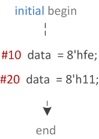

- [What is Verilog?](#what-is-verilog)
- [Best Practices](#best-practices)
  - [Verilog Naming Convention](#verilog-naming-convention)
- [Compiling and Simulating a file in Modelsim](#compiling-and-simulating-a-file-in-modelsim)
- [Block Statements](#block-statements)
  - [Sequential Block-Statements](#sequential-block-statements)
  - [Parallel Block Statements](#parallel-block-statements)
  - [Naming of Blocks](#naming-of-blocks)
- [`assign` Statement](#assign-statement)
- [`#<delay>` Statement](#delay-statement)
- [`initial` and `always` Statements](#initial-and-always-statements)
  - [Syntax for using `initial` statement](#syntax-for-using-initial-statement)
    - [Multiple `initial` statements in a program](#multiple-initial-statements-in-a-program)
- [`reg`](#reg)
- [`wire`](#wire)

# What is Verilog?

Verilog is a Hardware Description Language (HDL). 

It is a language used for describing a digital system such as a network switch, a microprocessor, a memory, or a flip-flop. 

We can describe any digital hardware by using HDL at any level. 

Designs described in HDL are independent of technology, very easy for designing and debugging, and are normally more useful than schematics, particularly for large circuits.

# Best Practices

Only one `module` should be defined per verilog file. 

## Verilog Naming Convention

| Construct                                                             | Style                          |
| --------------------------------------------------------------------- | ------------------------------ |
| Declarations (module, class, package, interface)                      | `lower_snake_case`             |
| Instance names                                                        | `lower_snake_case`             |
| Signals (nets and ports)                                              | `lower_snake_case`             |
| Variables, functions, tasks                                           | `lower_snake_case`             |
| Named code blocks                                                     | `lower_snake_case`             |
| **\`define** macros                                                   | `ALL_CAPS`                     |
| Tunable parameters for parameterized modules, classes, and interfaces | `UpperCamelCase`               |
| Constants                                                             | `ALL_CAPS` or `UpperCamelCase` |
| Enumeration types                                                     | `lower_snake_case_e`           |
| Other typedef types                                                   | `lower_snake_case_t`           |
| Enumerated value names                                                | `UpperCamelCase`               |

# Compiling and Simulating a file in Modelsim

1. Open modelsim 
2. `Create Project` (keep project name in PascalCase)
3. `Create New File` (Change file type from default `VHDL` to `Verilog`, and keep the library as default - `work`)
4. File is created
5. Right click on the file name and click on `Edit`
6. After writing the code, right click on the file again, and click on `Compile Selected`
7. `Status` symbol next to file name changes from a question mark to tick to indicate that compilation was successful. Successful message also shown in Transcript panel
8. Next, in order to convert the source code into a model, we have to simulate the compiled **module**.
9. Go to the `Library` panel, into the `work` library, right-click on the module and selecte `Simulate`.
10. The Layout of ModelSim changes from `No Design` to `Simulate`.
11. a. Select the `Instance` of the module from the `sim` tab, then drag the `Objects` i.e., the quantities you wish to see in the `Waves` panel
    b. Or right click on a particular quantity in Object panel and select `Add Waves` 
12. We can `Force` quantities to be a certain value in the `Waves` panel by right-clicking on them.
13. Press `F9` to run the simulation behaviour


# Block Statements

There are ways to group a set of statements together that are syntactically equivalent to a single statement and are known as Block Statements.

There are two types of block statements:
- Sequential
- Parallel

## Sequential Block-Statements

In Sequential Block-Statements, a set of statements are wrapped using `begin` and `end` keywords and will be executed sequentially in the given order, one after the other. 


After all the statements within the block are executed, control may be passed elsewhere. 

Delay values are treated relative to the time of execution of the previous statement. 



 In this example, the first statement in the `begin`-`end` block will be executed at `10` time units, and the second statement at `30` time units because of the relative nature. 
 
 It is `20` time units after execution of the previous statement.

## Parallel Block Statements
 
A Parallel Block-Statemet can execute statements concurrently and delay control can be used to provide time-ordering of the assignments. 

Statements are launched in parallel by wrapping them within the `fork` and `join` keywords.

Delay values are treated as absolute from the start of the Parallel Block. 


 In this example, the `fork`-`join` block will be launched after executing the statement at `10` time units.
 
 Statements within this block will be executed in parallel and the first statement that will be launched will be the one where data is assigned a value of `8'h00` since the delay for that is `10` time units after the launch of the fork-join. 
 
 After `10` MORE time units, the first statement will be launched and data will get the value `8'h11`.

## Naming of Blocks

Both [Sequential](#sequential-block-statements) and [Parallel](#parallel-block-statements) blocks can be named by adding `name_of_block` after the `begin` and `fork` keywords. 

```verilog
begin: name_seq  
    [statements]  
end  
fork: name_fork  
    [statements]  
join  
```

By doing this, the block can be referenced in a `disable` statement.

# `assign` Statement

TODO

# `#<delay>` Statement

TODO

# `initial` and `always` Statements

`initial` and `always` statements describe independent processes (blocks of code), meaning that the statements in one process execute autonomously. 

Both types of processes consist of procedural statements and both start immediately as the simulator is started. 

The difference between the two is that `initial` processes execute once, whereas `always` process execute repeatedly forever. 

As such, an `always` process must contain timing statements that will occasionally block execution and allow time to advance (time in `initial` and `always` process only advances when they are blocked). 

Thus, activity in these process progresses in a burst during which time does not advance, and then the activity blocks, which allows time to move forward.

## Syntax for using `initial` statement

```verilog
initial  
    [single statement]  
  
initial begin  
    [multiple statements]  
  
end  
```

### Multiple `initial` statements in a program

There are no limits to the number of initial blocks that can be defined inside a module. 


The code shown below has three initial blocks, all of which are STARTED AT THE SAME TIME and run in parallel.

However, depending on the statements and the delays within each initial block, the time taken to finish the block may vary.


# `reg`

TODO

# `wire`

TODO